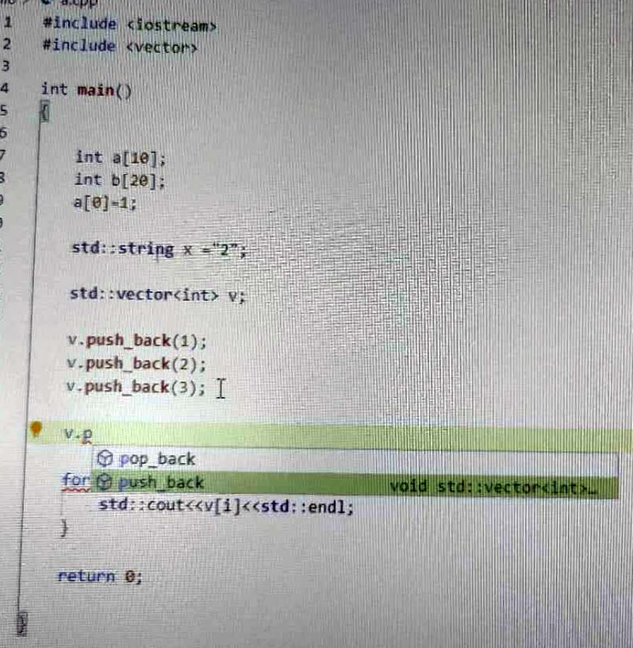

# 如何在windows上编写linux c++程序
本教程仅限于记录在ms内部使用vs code 编写 linux c++ 程序。
由于公司内部异常严格的环境，无法使用MinGW 或者 WSL等环境，因此无法在windows上安装c++库，在使用vs code编程时，自然也无法做到自动补全、错误提示等，生产效率过低。vs code仅仅退化为一个编辑器。

经过尝试多种手段，本人最终使用如下方法实现编码时自动补全、错误提示。

思路：既然本机找不到 include 库，那就从别的地方下载过来，但是哪里可以下载呢？在linux编译机里。

## 大致效果如下：

* 错误提示


* 检查头文件


* 自动提示




## 前置工作
已安装vs code， 且已安装cpptool插件，若不知道哪里装可问我。

`需要注意: vscode 与 工程需要在同一个文件系统中`

## 步骤
1. 进入linux系统，c/c++的系统库文件通常包含在 /usr/include 目录中。进去确认是否包含如 stdio.h 或者iostream等常用库，如果有，就没问题了，像下图这样。要是有就比较麻烦。


2. 想办法把这里的文件全部移到本地windows 系统中来。比如，先把文件移动到个人的主目录上，由于个人目录是NFS，在windows下可以访问，因此可以再从NFS移到本地。

3. 新建一个工程，将include目录放入其中。

4. 使用vs code 打开该工程既可以实现错误提示和自动补全。

5. 当然由于电脑配置不同，可能依旧无法实现。

6. 打开c++插件配置文件（如不知道哪里，可问我），在 C_CPP.default.includePath中加入如下路径。
如下：
```json
"C_CPP.default.includePath":[
    "${workspaceFolder}/**",
    "你的include文件夹绝对路径",
    "你的include文件夹绝对路径\\c++\\4.4.4", //也可能是其他版本号
    "你的include文件夹绝对路径\\c++\\4.4.4\\x86_64-redhat-linux"
]

```

同样的，在 C_CPP.default.browser.path、C_CPP.default.systemIncludePath 填入同样内容。

7. 此外， 还需要一下设置才可能有错误提示，其实只是一部分起效了，我也不知道是哪一部分。
```json
 "C_cpp.errorSquiggles":"Enable",
 "C_Cpp.experimentalFeatures":"Enable",
 "C_Cpp,default.cppStandard":"c++11",
 "C_Cpp.default.intelliSenseMode":"gcc-x64"

 ```

 8. 完成以上步骤，可以正常编码并错误提示、自动补全了。当然，这个系统库只能用于以上功能，无法在windows下使用这个库来编译程序。

 9. 至于如何编译，可以重新把文件拷回到NFS目录在Linux环境下编译。如果嫌麻烦，可以写一个bat脚本来复制文件。（如果会把本地文件link到NFS上那更好，可惜我不知道怎么做）。